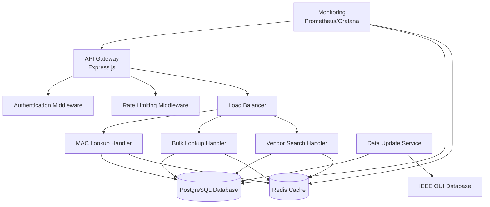

# macVendor.io Simplified Architecture

## System Overview

macVendor.io is a scalable, open-source MAC address vendor lookup API service. The architecture focuses on simplicity, reliability, and performance, supporting thousands of daily requests with high availability.

## Core Features

### Primary Services
- **MAC Vendor Lookup**: Fast manufacturer identification
- **Bulk Processing**: Batch query capabilities (up to 100 MACs)
- **Vendor Search**: Search vendors by name
- **Real-time Updates**: Regular data synchronization from IEEE
- **API Key Authentication**: Secure access with tiered rate limits
- **Monitoring**: Basic metrics and health checks

### Usage Tiers
- **Anonymous**: 1,000 requests/hour, 10,000/day
- **Registered**: 10,000 requests/hour, 100,000/day
- **Enterprise**: Custom limits (future)

## Architecture



## Technology Stack

### Backend
- **Runtime**: Node.js 18+ with TypeScript
- **Framework**: Express.js
- **Database**: PostgreSQL 15+
- **Cache**: Redis for caching

### Infrastructure
- **Containerization**: Docker
- **Deployment**: Docker Compose for development, cloud hosting for production
- **CI/CD**: GitHub Actions
- **Monitoring**: Prometheus + Grafana
- **Logging**: Structured JSON logs

### Hosting
- **Cloud Platform**: AWS, DigitalOcean, or similar
- **Backup**: Automated database backups

## Database Schema

### Primary Tables

```sql
-- MAC Address to Vendor Mapping
CREATE TABLE mac_vendors (
    id SERIAL PRIMARY KEY,
    mac_prefix VARCHAR(8) UNIQUE NOT NULL,  -- First 3 octets (OUI)
    vendor_name VARCHAR(255) NOT NULL,
    vendor_address TEXT,
    country_code CHAR(2),
    oui_assigned DATE,
    block_type VARCHAR(10),  -- MA-L, MA-M, MA-S
    last_updated TIMESTAMP DEFAULT NOW(),
    created_at TIMESTAMP DEFAULT NOW(),

    INDEX idx_mac_prefix (mac_prefix),
    INDEX idx_vendor_name (vendor_name),
    INDEX idx_country (country_code)
);

-- API Keys and Authentication
CREATE TABLE api_keys (
    id SERIAL PRIMARY KEY,
    key_hash VARCHAR(255) UNIQUE NOT NULL,
    name VARCHAR(255),
    tier VARCHAR(20) NOT NULL,  -- anonymous, registered, enterprise
    rate_limit_per_hour INTEGER NOT NULL,
    rate_limit_per_day INTEGER NOT NULL,
    is_active BOOLEAN DEFAULT TRUE,
    last_used_at TIMESTAMP,
    created_at TIMESTAMP DEFAULT NOW(),

    INDEX idx_key_hash (key_hash),
    INDEX idx_tier (tier)
);

-- Usage Tracking (for rate limiting and basic analytics)
CREATE TABLE api_usage (
    id SERIAL PRIMARY KEY,
    api_key_id INTEGER REFERENCES api_keys(id),
    endpoint VARCHAR(100) NOT NULL,
    ip_address INET,
    created_at TIMESTAMP DEFAULT NOW(),

    INDEX idx_api_key_id (api_key_id),
    INDEX idx_created_at (created_at)
);
```

## Security Framework

### Authentication & Authorization
- **API Key Management**: Secure API key generation with salted hashes; authenticate via `x-api-key` header.

### Rate Limiting
```javascript
const rateLimits = {
  anonymous: { requestsPerHour: 1000, requestsPerDay: 10000 },
  registered: { requestsPerHour: 10000, requestsPerDay: 100000 },
  enterprise: { requestsPerHour: 100000, requestsPerDay: 1000000 }
};
```

### Input Validation & Sanitization
- **MAC Address Validation**: Strict format checking with regex
- **SQL Injection Prevention**: Parameterized queries
- **XSS Protection**: Input sanitization
- **Payload Size Limits**: Limits on request sizes

### Data Privacy
- **Data Retention**: API usage logs retained for 30 days for rate limiting and abuse prevention
- **Encryption**: TLS for transit, database encryption for sensitive data

## Analytics & Monitoring

### Basic Metrics
```javascript
const metrics = {
  apiRequests: new Counter('api_requests_total'),
  successfulLookups: new Counter('successful_lookups_total'),
  responseTime: new Histogram('response_time_seconds'),
  cacheHitRate: new Gauge('cache_hit_rate')
};
```

- Metrics exposed at `/metrics` in Prometheus format
- Basic dashboards for API performance and system health

## Deployment Architecture

### Simple Deployment
```yaml
# docker-compose.yml
version: '3.8'
services:
  api:
    image: macvendor/api:latest
    ports:
      - "3000:3000"
    environment:
      - DATABASE_URL=postgresql://user:pass@db:5432/macvendor
      - REDIS_URL=redis://redis:6379
    depends_on:
      - db
      - redis

  db:
    image: postgres:15
    environment:
      - POSTGRES_DB=macvendor
      - POSTGRES_USER=user
      - POSTGRES_PASSWORD=pass

  redis:
    image: redis:7
```

### Scaling
- **Horizontal Scaling**: Multiple API instances behind load balancer
- **Database Scaling**: Read replicas for high read loads
- **Cache Scaling**: Redis Cluster for larger deployments

## Data Update Pipeline

### Source of Truth & Schedule
- **Sources**: IEEE OUI CSV (primary)
- **Cadence**: Weekly updates from IEEE, manual corrections as needed
- **Validation**: Regex validation of prefixes, ISO country codes, vendor normalization
- **Data Minimization**: Keep essential OUI → vendor mappings

### Retention & Privacy
- Usage logs retained for 30 days, then purged
- No personal data collection beyond IP for rate limiting

## Performance Optimization

### Caching Strategy
```javascript
const cacheConfig = {
  redis: {
    ttl: 3600 // 1 hour
  }
};

const cacheKey = (macAddress) => {
  return `mac:${macAddress.toUpperCase()}`;
};
```

### Database Optimization
- **Indexing**: Primary key on MAC prefix for fast lookups
- **Connection Pooling**: Efficient database connections
- **Query Optimization**: Simple, optimized queries

## Implementation Roadmap

### Phase 1: Core API (Weeks 1-4)
- Basic MAC lookup API
- PostgreSQL database setup
- Redis caching
- API key authentication
- Rate limiting

### Phase 2: Features (Weeks 5-8)
- Bulk processing
- Vendor search
- Data import from IEEE
- Basic monitoring
- Docker deployment

### Phase 3: Production (Weeks 9-12)
- Production deployment
- Automated data updates
- Enhanced monitoring
- Performance optimization
- Documentation

## Support & Success

### Support
- **Community**: GitHub Issues
- **Documentation**: API docs

### Success Metrics
- **Availability**: 99.9% uptime
- **Response Time**: < 100ms for 95% of requests
- **Data Accuracy**: > 99% vendor identification accuracy
